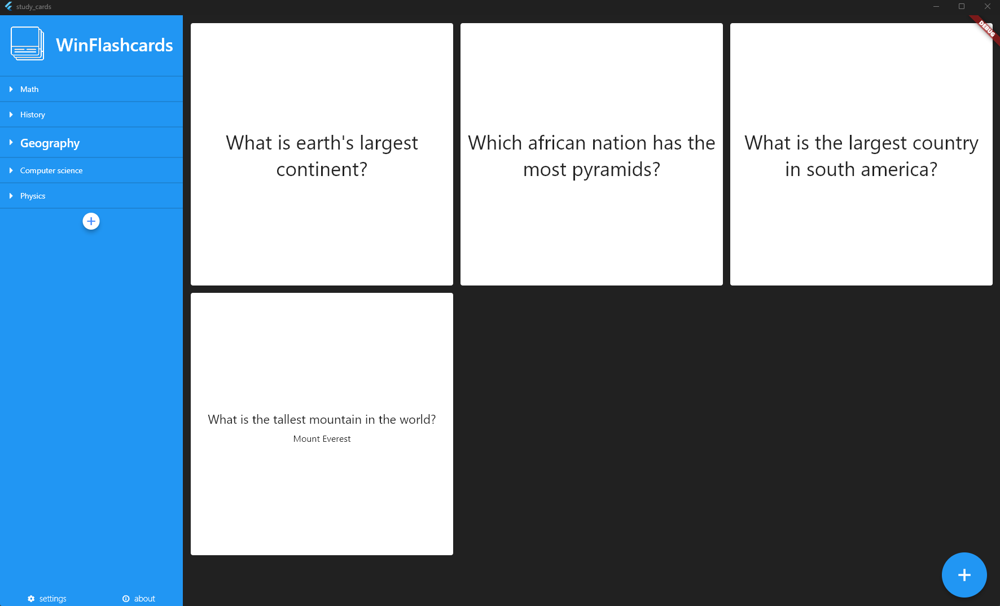

# winFlashcards

winFlashcards is an open-source free Windows Desktop application which lets you create digital flashcards to help you in your study.

"Flashcards" are just a piece of paper with a question on the front and the answer on the back.

## - How it works:
This method is very simple but effective: You can create a flashcard by typing a question and a well-formed correct answer (e.g. with the help of the book). Later on, when you want to study, you pick a flashcard, you read the question and try to answer it. Finally you can turn the flashcard so you can compare your answer with the correct one.

## - About the project:
This is just a little free-time simple project I am developing for my little sister who just started university! She brought me up with this study method and told me how all the free tools she tried were not adequate or not free. I found it nice to start this mini-project for her. ❣️

The project is written in Dart+Flutter SDK.
 
Nothing advanced here... just 10mins of coding here and there.

- 🔧 Work in Progress: first prototype is not complete.

Last prototype version screen:

